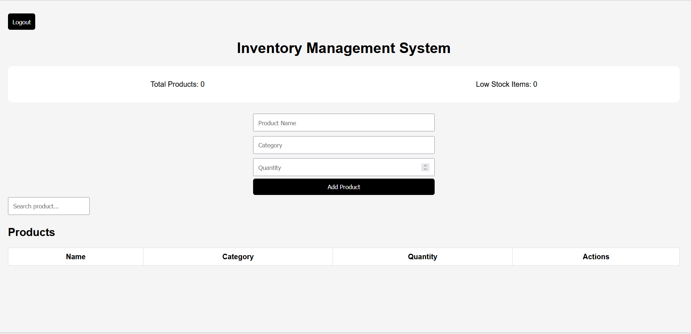
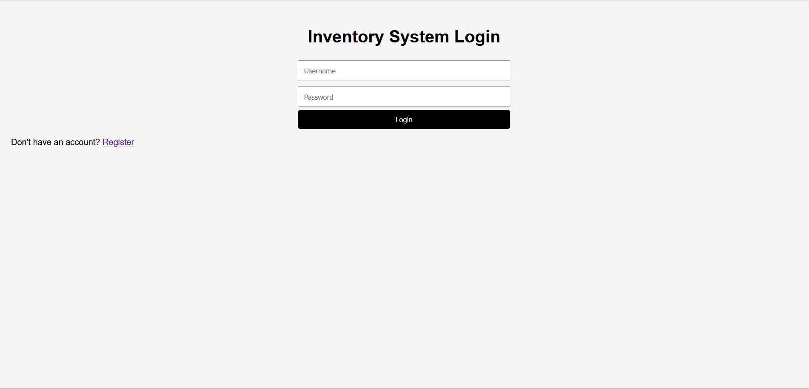
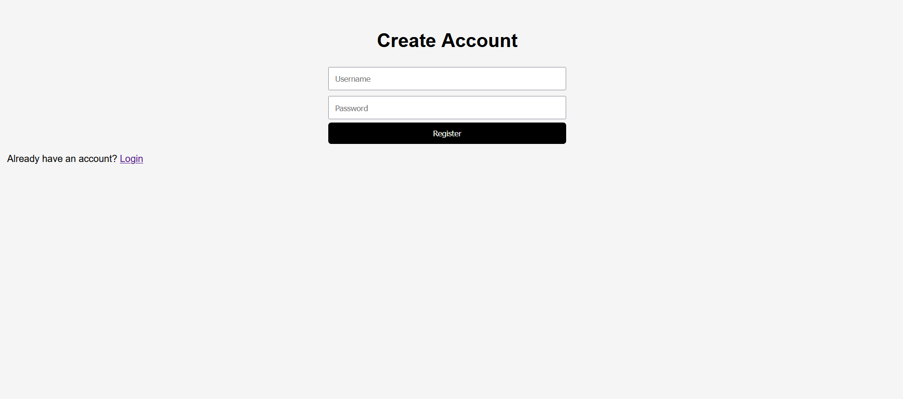
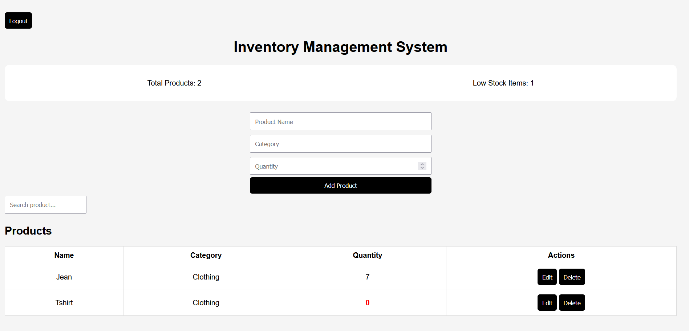

# 📦 Inventory Management System

A web-based inventory management application that enables users to manage products, track stock levels, and monitor low inventory. The system includes user authentication and a protected dashboard, simulating a real-world business environment.

---

## 🚀 Features

- 🔐 User Registration & Login
- 🔒 Protected Dashboard (Authentication)
- ➕ Add Products
- ✏️ Edit Product Quantity
- ❌ Delete Products
- 🔍 Search Functionality
- 📦 Product Categories
- 📊 Dashboard Analytics:
  - Total Products
  - Low Stock Alerts
- 💾 Local Storage Data Persistence

---

## 🛠️ Tech Stack

- HTML5
- CSS3
- JavaScript (Vanilla JS)
- Browser Local Storage

---
## 📁 Project Structure


inventory-system/
│── login.html
│── register.html
│── index.html
│── style.css
│── script.js
│── auth.js

---

## ⚙️ Getting Started

1. Clone the repository:
   ```bash
   git clone https://github.com/imma1114/inventory-management-system.git


## 📸 Screenshots

### Dashboard


### Login Page


### Register Page


### Inventory Page


### 🧠 Key Concepts
DOM Manipulation
Event Handling
Local Storage
Authentication Logic
CRUD Operations

### 🔮 Future Improvements
Backend integration (Node.js / Firebase)
Role-based access control
Mobile responsiveness
Cloud deployment
Advanced analytics

### 👩‍💻 Author

### Immaculate Nhlanhla Modise

Diploma in IT: Software Development |
Advanced Diploma in Information Resource Management
🔗 LinkedIn: https://www.linkedin.com/in/immaculatemodise

 ### ⚠️ Disclaimer

This project uses Local Storage for demonstration purposes and is not suitable for production environments without a secure backend.

### ⭐️ Support

If you found this project helpful, please give it a ⭐️


